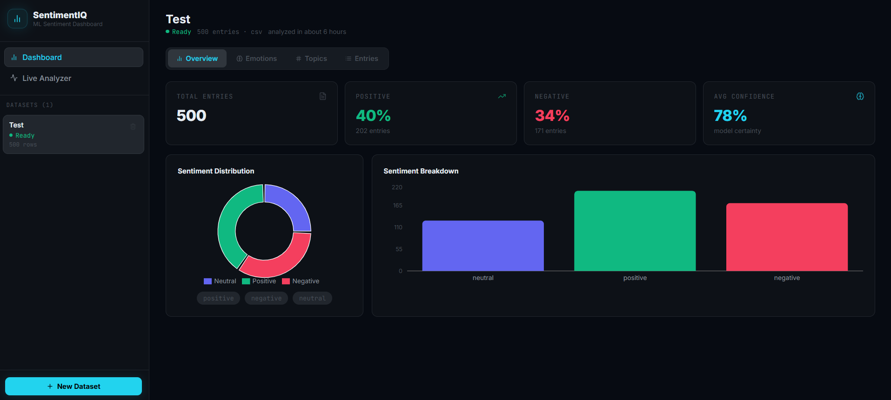
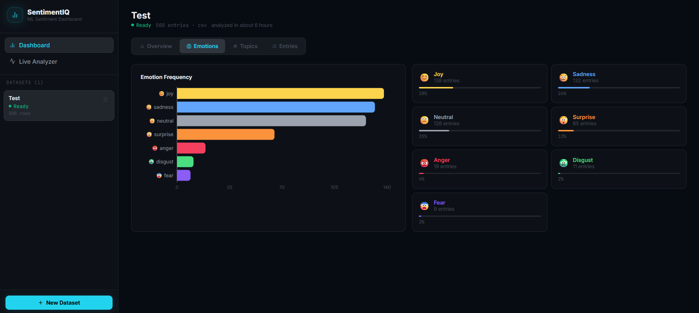
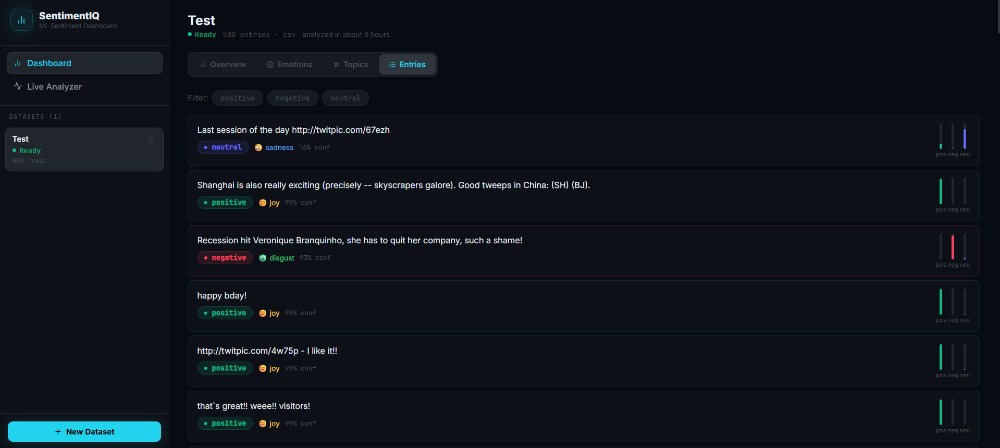

# SentimentIQ — ML Sentiment Analysis Dashboard

Real ML sentiment analysis dashboard. Not LLM-wrapped — actual transformer models running inference.





---
Live = https://sentimentiq.onrender.com


## Models Used
- **Sentiment**: `cardiffnlp/twitter-roberta-base-sentiment-latest` — RoBERTa fine-tuned on 124M tweets. Returns positive/negative/neutral with confidence scores.
- **Emotion**: `j-hartmann/emotion-english-distilroberta-base` — 7 emotions: joy, anger, fear, sadness, surprise, disgust, neutral.
- **Topic Clustering**: TF-IDF vectorization + KMeans — no model required, pure sklearn.

## Features
- Upload CSV (auto-detects text + timestamp columns)
- Paste text entries (one per line)
- Sentiment distribution pie chart
- Emotion frequency bar chart
- Trend over time (if timestamps in CSV)
- Topic clustering with keywords
- Live text analyzer — type and see sentiment in real time (debounced)
- Filter entries by sentiment
- Per-entry confidence score mini charts

## Run

### Backend
```bash
cd backend
py -3.12 -m venv venv
venv\Scripts\activate
pip install -r requirements.txt
copy .env.example .env
uvicorn app.main:app --reload
```
> First run downloads both models (~500MB total). Subsequent runs are instant from cache.

### Frontend
```bash
cd frontend
npm install
npm run dev
```

## Git — First Push
```bash
cd sentimentiq
git init
git add .
git commit -m "day 23: SentimentIQ - real ML sentiment dashboard, RoBERTa + emotion model"
git branch -M main
git remote add origin https://github.com/Susmithay08/SentimentIQ.git
git push -u origin main
```

## Deploy on Render

### Backend — Web Service
| Setting | Value |
|---------|-------|
| Root Directory | `backend` |
| Build Command | `pip install -r requirements.txt` |
| Start Command | `uvicorn app.main:app --host 0.0.0.0 --port $PORT` |
| Instance Type | **Standard (2GB RAM)** — RoBERTa needs ~1.2GB RAM |

> ⚠️ **Use Standard instance minimum.** The two transformer models together need ~1.2GB RAM to load. Free tier (512MB) will OOM crash.

**Environment Variables:**
```
FRONTEND_URL = https://your-frontend.onrender.com
```

### Frontend — Static Site
| Setting | Value |
|---------|-------|
| Root Directory | `frontend` |
| Build Command | `npm install && npm run build` |
| Publish Directory | `dist` |

**Environment Variables:**
```
VITE_API_URL = https://your-backend.onrender.com
```

## Stack
FastAPI · Transformers (HuggingFace) · PyTorch · scikit-learn · SQLAlchemy · React · Recharts · Zustand · Framer Motion · Render
